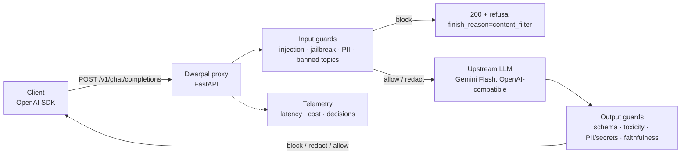

# Dwarpal

**A versioned guardrails layer for LLM applications.** Dwarpal (द्वारपाल, "gatekeeper") is an
OpenAI-compatible proxy that sits between your app and any LLM. It checks inputs for prompt
injection, jailbreaks, PII and banned topics, and checks outputs for schema errors, toxicity,
PII/secret leaks and claims unsupported by the supplied context. Every check is a versioned YAML
policy, scored separately against a hand-written red-team set in CI, so a drop in catch rate or a
rise in false positives blocks the merge.

> Live demo: deploy-ready, not hosted (see [Deploy](#deploy)); runs locally in two commands or one `docker run` · Dashboard: _TBD (PR-07)_

## Problem

LLM apps usually have nothing between the user and the model. Jailbreaks and injected prompts get
in; PII, secrets and made-up answers get out; and teams can't measure how well their filters work,
so filters get tuned by feel and silently regress.

## Architecture



- **Proxy, not a library.** Any client that speaks the OpenAI API works by changing `base_url`.
- **Guards** implement one interface (`dwarpal/guards/base.py`) and return allow / block / redact / flag.
- **Policies** (`policies/*.yaml`) configure each guard: version, stages, action, threshold, params.
  The version of every policy that ran is returned in the `X-Dwarpal-Policies` header.
- **Blocked requests** return HTTP 200 with a refusal and `finish_reason: "content_filter"`,
  the same way OpenAI reports its own filtering.

More detail: [docs/architecture.md](docs/architecture.md).

| Guard | Stage | Policy | Status |
|---|---|---|---|
| max_length (reference) | input | `policies/max_length.yaml` | ✅ |
| prompt_injection, jailbreak | input | `policies/prompt_injection.yaml`, `policies/jailbreak.yaml` | ✅ |
| pii, secrets | input + output | `policies/pii.yaml`, `policies/secrets.yaml` | ✅ |
| banned_topics, toxicity | input / output | `policies/banned_topics.yaml`, `policies/toxicity.yaml` | ✅ |
| output_schema, faithfulness | output | `policies/output_schema.yaml`, `policies/faithfulness.yaml` | ✅ |

## Results

_Filled in by PR-07 from `make eval` and `make bench`. No numbers, no credit._

| Policy | Catch rate (dev) | FPR (dev) | Catch rate (holdout) | p50 added latency |
|---|---|---|---|---|
| _TBD_ | | | | |

| Metric | Value |
|---|---|
| Added latency p50 / p99 | _TBD_ |
| Throughput (req/s) | _TBD_ |
| Cost per request | _TBD_ |

## Setup

Requires [uv](https://docs.astral.sh/uv/). Python 3.11 is installed by uv automatically.

```bash
git clone https://github.com/shreyas-garg/Dwarpal.git && cd Dwarpal
uv sync --all-extras
cp .env.example .env          # add your GEMINI key as UPSTREAM_API_KEY
make dev                      # proxy on http://localhost:8000
```

Without an API key, run against the mock model:

```bash
make mock                     # terminal 1: fake LLM on :9000
make dev-mock                 # terminal 2: proxy on :8000 pointed at the mock
```

The demo chat is at http://localhost:8000/demo (try the attack dropdown).
`uv run python scripts/smoke_data_leak.py --mock` checks the PII and secrets guards against the
running proxy.

Call it like OpenAI:

```python
from openai import OpenAI

client = OpenAI(base_url="http://localhost:8000/v1", api_key="dev")
r = client.chat.completions.create(
    model="gemini-2.5-flash",
    messages=[{"role": "user", "content": "How do I export invoices?"}],
    extra_body={"dwarpal": {"context": ["Invoices can be exported as CSV or PDF."]}},
)
print(r.choices[0].message.content, r.choices[0].finish_reason)
```

`make lint test` runs what CI runs.

## Deploy

**Deploy-ready; not hosted.** The deployment infrastructure is built and tested end to end. The
only missing piece is hosting: Hugging Face now requires a PRO plan for the free CPU Space tier,
and free hosts without a card (Render, Koyeb) give 512 MB of RAM, less than the guard models
need. A live URL is optional for this project, so we did not pay for one. Turning it on is
configuration only, no code changes.

What is ready and tested:

- **Image:** `Dockerfile` bakes every model in at build time (`scripts/fetch_models.py`), runs
  offline (`HF_HUB_OFFLINE=1`) as a non-root user (uid 1000, as on Spaces), and stamps the
  commit SHA into `/healthz`. Built and run locally: ~5 min build, 1.95 GB image.
- **Pipeline:** `.github/workflows/deploy.yml` pushes `main` to a Hugging Face Docker Space
  (`scripts/deploy_space.py`), then `scripts/smoke_deploy.py` waits for the Space to report that
  commit and checks a safe request is answered while an injection and a banned topic are
  blocked. The smoke test passes against the local container.
- **Budget limits:** see below.

Run the image yourself:

```bash
docker build -t dwarpal .
docker run -p 7860:7860 -e UPSTREAM_API_KEY=<gemini key> dwarpal   # http://localhost:7860/demo
```

To go live, set a repo secret `HF_TOKEN` (write token), a repo variable `HF_SPACE`
(`<owner>/<space>`, on an account with CPU Spaces), and the Space secret `UPSTREAM_API_KEY`;
until then the deploy job skips itself. The image limits each IP to 20
requests a minute and the whole demo to 200 a day (`RATE_LIMIT_PER_MINUTE`,
`DAILY_REQUEST_CAP`, overridable as Space variables). Details:
[docs/decisions/0006](docs/decisions/0006-content-guards-and-deployment.md).

## Scope

- No model training: guards use heuristics, pretrained classifiers and an LLM judge.
- Faithfulness is checked only against context supplied with the request.
- English only, single tenant, no billing layer, no streaming (`stream=true` returns 400).
- The demo app is trivial on purpose; the guardrails layer and its eval harness are the deliverable.
- Free-tier deployment within a ~$20 budget.

## Contributing

See [CONTRIBUTING.md](CONTRIBUTING.md).
