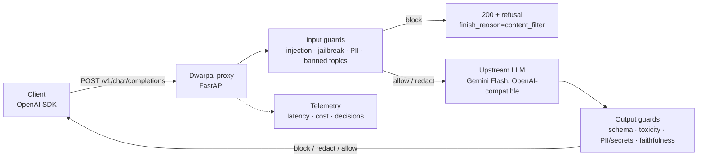

# Dwarpal

**A versioned guardrails layer for LLM applications.** Dwarpal (द्वारपाल, "gatekeeper") is an
OpenAI-compatible proxy that sits between your app and any LLM. It checks inputs for prompt
injection, jailbreaks, PII and banned topics, and checks outputs for schema errors, toxicity,
PII/secret leaks and claims unsupported by the supplied context. Every check is a versioned YAML
policy, scored separately against a hand-written red-team set in CI, so a drop in catch rate or a
rise in false positives blocks the merge.

> Live demo: deploy-ready, not hosted (see [Deploy](#deploy)); runs locally in two commands or one `docker run` · Dashboard: local, `make dashboard` (see [Dashboard](#dashboard))

## Problem

LLM apps usually have nothing between the user and the model. Jailbreaks and injected prompts get
in; PII, secrets and made-up answers get out; and teams can't measure how well their filters work,
so filters get tuned by feel and silently regress.

## Architecture



- **Proxy, not a library.** Any client that speaks the OpenAI API works by changing `base_url`.
- **Guards** implement one interface (`dwarpal/guards/base.py`) and return allow / block / redact / flag.
- **Policies** (`policies/*.yaml`) configure each guard: version, stages, action, threshold, params.
  The version of every policy that ran is returned in the `X-Dwarpal-Policies` header.
- **Blocked requests** return HTTP 200 with a refusal and `finish_reason: "content_filter"`,
  the same way OpenAI reports its own filtering.

More detail: [docs/architecture.md](docs/architecture.md).

| Guard | Stage | Policy | Status |
|---|---|---|---|
| max_length (reference) | input | `policies/max_length.yaml` | ✅ |
| prompt_injection, jailbreak | input | `policies/prompt_injection.yaml`, `policies/jailbreak.yaml` | ✅ |
| pii, secrets | input + output | `policies/pii.yaml`, `policies/secrets.yaml` | ✅ |
| banned_topics, toxicity | input / output | `policies/banned_topics.yaml`, `policies/toxicity.yaml` | ✅ |
| output_schema, faithfulness | output | `policies/output_schema.yaml`, `policies/faithfulness.yaml` | ✅ |

## Results

Every number here comes from a file in this repo; `make eval` and `make bench` regenerate them.

### Catch rate and false positives

From `make eval` ([eval/reports/latest.md](eval/reports/latest.md)). Each guard is scored
alone on its own attacks and on every safe case of its stage; the full pipeline is then scored
end to end. The dev set (116 cases) gates every merge. The holdout set (31 cases) was written
before any guard existed and is reported only.

| Policy | Dev catch rate | Dev FPR | Holdout catch rate | Holdout FPR |
|---|---|---|---|---|
| `prompt_injection@1.1.1` | 100% (10/10) | 0% (0/45) | 100% (2/2) | 0% (0/11) |
| `jailbreak@1.1.1` | 100% (10/10) | 0% (0/45) | 100% (2/2) | 0% (0/11) |
| `pii@1.0.1` | 100% (10/10) | 0% (0/60) | 100% (2/2) | 0% (0/15) |
| `secrets@1.0.1` | 100% (6/6) | 0% (0/60) | 100% (2/2) | 0% (0/15) |
| `banned_topics@1.0.0` | 100% (6/6) | 0% (0/45) | 100% (2/2) | 0% (0/11) |
| `toxicity@1.1.0` | 100% (5/5) | 0% (0/15) | 100% (2/2) | 0% (0/4) |
| `output_schema@1.0.0` | 100% (4/4) | 0% (0/15) | 0% (0/2) | 0% (0/4) |
| `faithfulness@1.0.0` | 100% (5/5) | 0% (0/15) | 100% (2/2) | 0% (0/4) |
| `max_length@1.0.0` | — (no attacks) | 0% (0/45) | — (no attacks) | 0% (0/11) |
| **Full pipeline** | **100% (56/56)** | **0% (0/60)** | **87.5% (14/16)** | **0% (0/15)** |

With 2 to 10 attacks per guard the 95% intervals are wide (10/10 is 0.72–1.00), so these
numbers say "no regression", not "always works". The two holdout misses are requests that ask
for JSON without declaring a schema, which `output_schema` does not check by design
([0007](docs/decisions/0007-output-guards-and-pipeline.md)).

### Latency, throughput and cost

From `make bench` ([results/benchmarks.md](results/benchmarks.md)) on an Apple M3 laptop (8 cores,
16 GB RAM). The proxy sits in front of the mock upstream, which takes a fixed 300 ms per call,
so the numbers are Dwarpal's own overhead. Locust replays the dev set's safe questions for 30 s
per run, with the guard decision cache off. *Added latency* is total time minus the upstream
call, as the proxy logs it.

| Scenario | Concurrent users | Requests/s | Added latency p50 | Added latency p99 | Safe requests refused |
|---|---:|---:|---:|---:|---:|
| No guards | 1 | 3.3 | 0.0 ms | 0.1 ms | 0% |
| No guards | 50 | 149.4 | 0.0 ms | 0.0 ms | 0% |
| Cheap guards only | 50 | 151.8 | 9.8 ms | 26.9 ms | 0% |
| All guards, plain chat | 1 | 2.7 | **60 ms** | **123 ms** | 0% |
| All guards, plain chat | 10 | 20.5 | 155 ms | 496 ms | 0% |
| All guards, plain chat | 50 | 26.9 | 1,577 ms | 2,533 ms | 63% |
| All guards + FAQ as context | 1 | 0.4 | 2,260 ms | 2,284 ms | 0% |
| All guards + FAQ as context | 10 | 3.3 | 3,006 ms | 3,062 ms | 100% |

- **Added latency, all guards: 60 ms p50, 123 ms p99**, one request at a time. This matches the
  eval's end-to-end 58.6 ms p50. The slowest guards are the two injection classifiers (30 ms
  p50, 84 ms p99 each), which run side by side.
- **Throughput: about 20 requests/s with every guard on**, against 149 with none (the 300 ms
  upstream caps 50 users at about 166). The CPU models are the limit. Somewhere between 10 and
  50 requests at once they start to overrun their `timeout_ms`. PII and injection checks fail
  closed, so safe requests are refused rather than let through unchecked: 63% at 50 users,
  nearly all by `pii` at its 1 s budget.
- **With context, the slow part is the context scan, not the judge.** The injection guards also
  scan the 2 KB FAQ for indirect injection: 1.9 s each, against the judge stand-in's 0.3 s (the
  real judge takes 1.7 s p50). From 10 users those scans time out.
- **End-to-end latency with Gemini: 1,235 ms p50, 15,200 ms p99.** This comes from 50 real
  support questions sent one after another through the proxy to `gemini-3.5-flash-lite`, with
  the demo's FAQ system prompt and no context ([results/real_run.md](results/real_run.md)).
  Dwarpal added **63 ms p50, 141 ms p99**, in line with the load test. The rest is the model: its
  calls took 1,173 ms p50, but 3 of the 50 took over 3 s and the slowest 15.1 s.
- **Cost per request: $0.000238** at list price ([config/pricing.yaml](config/pricing.yaml),
  $0.30 / $2.50 per 1M input / output tokens), from the same run: on average 589 input and 24
  output tokens, $0.0119 for all 50. Dwarpal's guards added no model cost to these requests. The
  faithfulness judge adds about $0.0004–0.0005 per checked reply, measured against Gemini in
  [0007](docs/decisions/0007-output-guards-and-pipeline.md).

More detail, and what we would change: [docs/decisions/0008](docs/decisions/0008-telemetry-dashboard-and-numbers.md).

**Resume line.** Built Dwarpal, an OpenAI-compatible guardrails proxy with nine versioned YAML
policies (prompt injection, jailbreak, PII, secrets, banned topics, toxicity, JSON schema,
faithfulness, max length). Gated every merge on a hand-written 116-case red-team set in CI,
reaching 100% catch rate at 0% false positives (87.5% and 0% on a 31-case holdout set) with
60 ms p50 added latency at $0.00024 per request. Added per-request telemetry (SQLite, Langfuse
over OpenTelemetry), a Streamlit dashboard and a Docker image ready for Hugging Face Spaces.

## Setup

Requires [uv](https://docs.astral.sh/uv/). Python 3.11 is installed by uv automatically.

```bash
git clone https://github.com/shreyas-garg/Dwarpal.git && cd Dwarpal
uv sync --all-extras
cp .env.example .env          # add your GEMINI key as UPSTREAM_API_KEY
make dev                      # proxy on http://localhost:8000
```

Without an API key, run against the mock model:

```bash
make mock                     # terminal 1: fake LLM on :9000
make dev-mock                 # terminal 2: proxy on :8000 pointed at the mock
```

The demo chat is at http://localhost:8000/demo (try the attack dropdown).
`uv run python scripts/smoke_data_leak.py --mock` checks the PII and secrets guards against the
running proxy.

Call it like OpenAI:

```python
from openai import OpenAI

client = OpenAI(base_url="http://localhost:8000/v1", api_key="dev")
r = client.chat.completions.create(
    model="gemini-2.5-flash",
    messages=[{"role": "user", "content": "How do I export invoices?"}],
    extra_body={"dwarpal": {"context": ["Invoices can be exported as CSV or PDF."]}},
)
print(r.choices[0].message.content, r.choices[0].finish_reason)
```

`make lint test` runs what CI runs.

## Dashboard

Every request the proxy handles is logged to `data/requests.db` (SQLite) with each guard's
decision and time, the upstream time and tokens, the cost, and the latency Dwarpal added. The
prompt itself is stored only as a SHA-256 (`LOG_PROMPTS=false`). The dashboard reads that log
through two admin endpoints, so first set `ADMIN_TOKEN` in `.env` to any long random string.
Then:

```bash
make dev                      # or `make mock` + `make dev-mock`, without an API key
make dashboard                # another terminal: http://localhost:8501
```

Send a few messages from http://localhost:8000/demo and they show up in the dashboard, with each
guard's time. The same data is available directly:

```bash
curl -H "X-Admin-Token: <your ADMIN_TOKEN>" "http://localhost:8000/v1/dwarpal/stats?window=1h"
curl -H "X-Admin-Token: <your ADMIN_TOKEN>" "http://localhost:8000/v1/dwarpal/requests?limit=100"
sqlite3 data/requests.db "select request_id, blocked_by, added_ms, cost_usd from requests"
```

Every response also has an `X-Dwarpal-Added-Latency-Ms` header. With `LANGFUSE_PUBLIC_KEY` and
`LANGFUSE_SECRET_KEY` set (Langfuse Cloud free tier), each request is also a Langfuse trace:
one span per guard and one for the upstream call, tagged with the policy versions. The dashboard
is not hosted, for the same reason as the proxy (see [Deploy](#deploy)). Design notes:
[docs/decisions/0008](docs/decisions/0008-telemetry-dashboard-and-numbers.md).

## Deploy

**Deploy-ready; not hosted.** The deployment infrastructure is built and tested end to end. The
only missing piece is hosting: Hugging Face now requires a PRO plan for the free CPU Space tier,
and free hosts without a card (Render, Koyeb) give 512 MB of RAM, less than the guard models
need. A live URL is optional for this project, so we did not pay for one. Turning it on is
configuration only, no code changes.

What is ready and tested:

- **Image:** `Dockerfile` bakes every model in at build time (`scripts/fetch_models.py`), runs
  offline (`HF_HUB_OFFLINE=1`) as a non-root user (uid 1000, as on Spaces), and stamps the
  commit SHA into `/healthz`. Built and run locally: ~5 min build, 1.95 GB image.
- **Pipeline:** `.github/workflows/deploy.yml` pushes `main` to a Hugging Face Docker Space
  (`scripts/deploy_space.py`), then `scripts/smoke_deploy.py` waits for the Space to report that
  commit and checks a safe request is answered while an injection and a banned topic are
  blocked. The smoke test passes against the local container.
- **Budget limits:** see below.

Run the image yourself:

```bash
docker build -t dwarpal .
docker run -p 7860:7860 -e UPSTREAM_API_KEY=<gemini key> dwarpal   # http://localhost:7860/demo
```

To go live, set a repo secret `HF_TOKEN` (write token), a repo variable `HF_SPACE`
(`<owner>/<space>`, on an account with CPU Spaces), and the Space secret `UPSTREAM_API_KEY`;
until then the deploy job skips itself. The image limits each IP to 20
requests a minute and the whole demo to 200 a day (`RATE_LIMIT_PER_MINUTE`,
`DAILY_REQUEST_CAP`, overridable as Space variables). Details:
[docs/decisions/0006](docs/decisions/0006-content-guards-and-deployment.md).

## Scope

- No model training: guards use heuristics, pretrained classifiers and an LLM judge.
- Faithfulness is checked only against context supplied with the request.
- English only, single tenant, no billing layer, no streaming (`stream=true` returns 400).
- The demo app is trivial on purpose; the guardrails layer and its eval harness are the deliverable.
- Free-tier deployment within a ~$20 budget.
